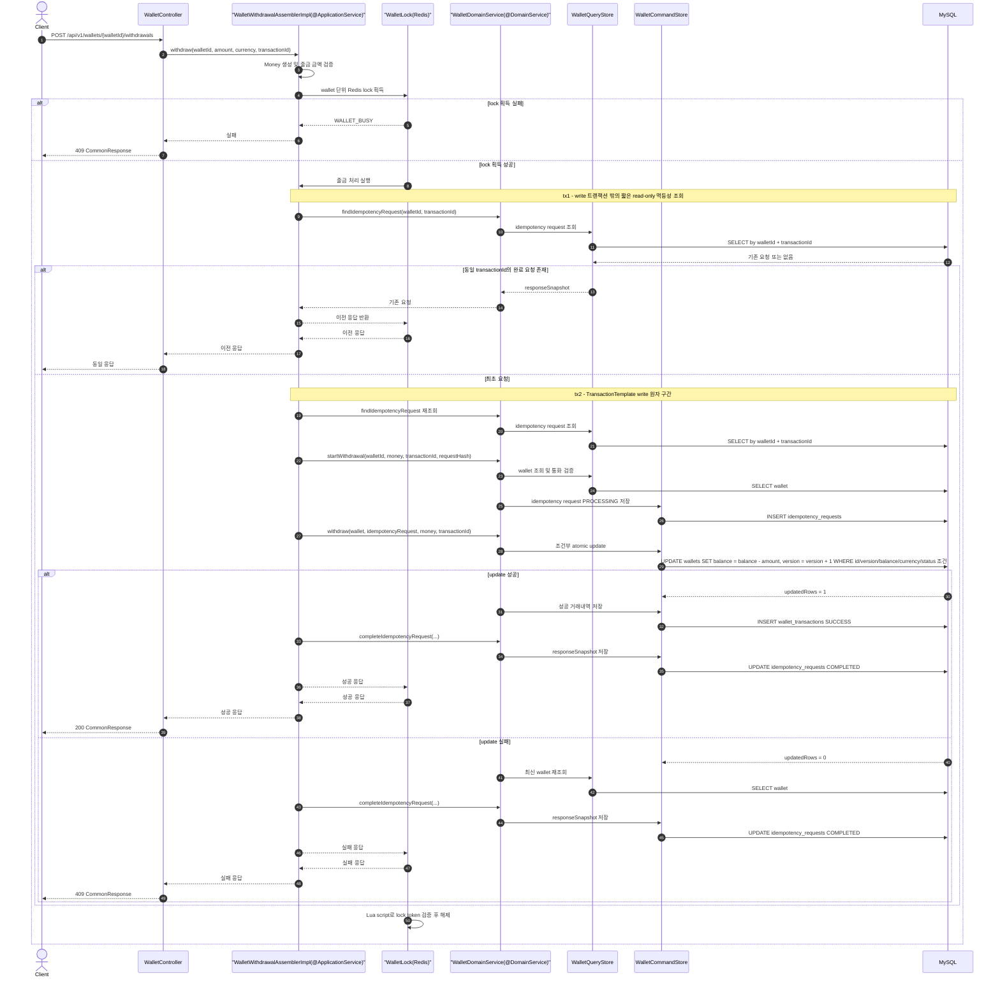

# Wallet Service

동일 월렛에 대한 다수의 동시 출금 요청에서도 잔액 무결성을 보장하는 Spring Boot 기반 월렛 API입니다.

## 기술 스택

- Kotlin 1.9
- Spring Boot 3.5
- Spring Web
- Spring Data JPA
- MySQL 8.4
- Redis 7.4
- Docker Compose
- Testcontainers

## 실행 방법

### 1. 인프라 실행

```bash
docker compose up -d mysql redis
```

MySQL과 Redis가 실행됩니다.

- MySQL: `localhost:3306`
- Redis: `localhost:6379`

### 2. 애플리케이션 실행

로컬 개발 환경에서는 `local` 프로파일을 활성화합니다. 이 프로파일에서만 Swagger UI와 생성된 OpenAPI YAML 정적 서빙이 켜집니다.

```bash
SPRING_PROFILES_ACTIVE=local ./gradlew bootRun
```

서버는 기본적으로 `http://localhost:8080`에서 실행됩니다.

## DB 세팅

MySQL 컨테이너가 처음 생성될 때 아래 DDL이 자동 실행됩니다.

```text
docker/mysql/init/001_create_wallet_schema.sql
```

Docker Compose가 이 경로를 MySQL 초기화 디렉터리에 마운트합니다.

```yaml
./docker/mysql/init:/docker-entrypoint-initdb.d:ro
```

이미 생성된 DB volume이 있으면 init SQL은 다시 실행되지 않습니다. 스키마를 처음부터 다시 만들려면 다음 명령을 실행합니다.

```bash
docker compose down -v
docker compose up -d mysql redis
```

### 초기 데이터

DDL에 테스트용 유저와 월렛이 포함되어 있습니다.

```sql
INSERT INTO users (id, email, name)
VALUES ('sample-user', 'sample@example.com', 'Sample User')
ON DUPLICATE KEY UPDATE email = VALUES(email), name = VALUES(name);

INSERT INTO wallets (id, user_id, balance, currency, version, wallet_status)
VALUES ('sample-wallet', 'sample-user', 100000.0000, 'KRW', 0, 'ACTIVE')
ON DUPLICATE KEY UPDATE balance = VALUES(balance), currency = VALUES(currency), wallet_status = VALUES(wallet_status);
```

## API

API 문서는 Spring REST Docs 기반 테스트로 생성합니다. 비즈니스 컨트롤러에는 OpenAPI/Swagger annotation을 두지 않고, `src/test`의 문서화 테스트가 실제 API를 호출하며 request/response snippet과 OpenAPI 3 스펙을 생성합니다.

문서 생성:

```bash
./gradlew test --tests com.wannabe.wallet.docs.WalletApiDocumentationTest --rerun-tasks openapi3
```

생성 결과:

```text
build/generated-snippets/
build/api-spec/openapi3.yaml
```

애플리케이션 실행 후 Swagger UI로 확인:

```bash
SPRING_PROFILES_ACTIVE=local ./gradlew bootRun
```

브라우저에서 [http://localhost:8080/swagger-ui.html](http://localhost:8080/swagger-ui.html)로 접속하면 테스트로 생성된 OpenAPI 문서를 확인할 수 있습니다. Swagger UI는 런타임 reflection으로 API 문서를 만들지 않고, `build/api-spec/openapi3.yaml`을 `/openapi/openapi3.yaml`로 서빙해서 표시합니다. `application.yaml`에서는 Swagger 노출을 기본 비활성화하고, `application-local.yaml`에서만 활성화해 dev, stage, prod 환경에서 문서 UI가 실수로 노출되지 않도록 했습니다.

아래 예시는 로컬에서 빠르게 호출해보기 위한 quick reference입니다.

### 출금

```http
POST /api/v1/wallets/{walletId}/withdrawals
```

요청:

```json
{
  "amount": 10000,
  "transactionId": "TXN-001",
  "currency": "KRW"
}
```

성공 응답 `200 OK`:

```json
{
  "code": "SUCCESS",
  "status": 200,
  "data": {
    "transactionId": "TXN-001",
    "walletId": "sample-wallet",
    "type": "WITHDRAWAL",
    "status": "SUCCESS",
    "amount": 10000,
    "currency": "KRW",
    "balance": 90000.0000,
    "version": 1,
    "processedAt": "2026-05-21T01:30:36.117000"
  }
}
```

모든 응답은 `code`, `status`, `data` 형식을 사용합니다. 성공 시 `code`는 `SUCCESS`, 실패 시 `code`는 `FAILED`입니다.
실패 요청은 월렛 잔액을 변경하지 않으므로 `wallet_transactions`에는 저장하지 않습니다. 동일 실패 요청의 멱등 응답은 `idempotency_requests.response_snapshot`에 원본 응답 문자열을 보존해 재사용합니다.

잔액 부족 `409 Conflict`:

```json
{
  "code": "FAILED",
  "status": 409,
  "data": {
    "errorCode": "INSUFFICIENT_BALANCE",
    "message": "Insufficient wallet balance"
  }
}
```

### 거래내역 조회

```http
GET /api/v1/wallets/{walletId}/transactions
```

`transactionType` query parameter를 생략하면 전체 거래내역을 조회합니다.
`deposit`은 입금, `withdraw`는 출금만 조회합니다.
`ALL`은 지원하지 않습니다.

응답:

```json
{
  "code": "SUCCESS",
  "status": 200,
  "data": {
    "transactions": [
      {
        "transactionId": "TXN-001",
        "walletId": "sample-wallet",
        "type": "WITHDRAWAL",
        "status": "SUCCESS",
        "amount": 10000,
        "currency": "KRW",
        "balance": 90000.0000,
        "version": 1,
        "processedAt": "2026-05-21T01:30:36.117000"
      }
    ]
  }
}
```

### curl 예시

```bash
curl -X POST http://localhost:8080/api/v1/wallets/sample-wallet/withdrawals \
  -H "Content-Type: application/json" \
  -d '{
    "amount": 10000,
    "transactionId": "TXN-001",
    "currency": "KRW"
  }'
```

```bash
curl http://localhost:8080/api/v1/wallets/sample-wallet/transactions
```

```bash
curl "http://localhost:8080/api/v1/wallets/sample-wallet/transactions?transactionType=withdraw"
```

## 설계 결정

ERD 문서는 [docs/wallet-erd.html](docs/wallet-erd.html)에 정리했습니다.

### 패키지 구조

헥사고날 아키텍처와 DDD 계층 구조를 조합했습니다.

```text
presentation
  controller
  model
    request
    response
application
  common
  wallet
    assembler
    dto
domain
  wallet
    enums
    error
    exception
    model
    port
    service
    vo
infrastructure
  adapter
  jpa
    entity
```

- `presentation`: REST API 요청/응답 모델과 컨트롤러
- `application`: 유스케이스 interface와 `@ApplicationService` 구현체, assembler, application DTO
- `domain`: 월렛 도메인 모델, VO, enum, error code, exception, 도메인 서비스, port
- `infrastructure`: JPA repository, `*JPAEntity`, Redis lock adapter, query/command adapter

의존성 방향은 `presentation -> application -> domain <- infrastructure`를 따릅니다. application은 Redis나 JPA 구현체를 직접 참조하지 않고 `WalletLock` 포트와 도메인 서비스를 사용합니다. `WalletDomainService`는 `WalletQueryStore`, `WalletCommandStore` 포트를 통해 저장소와 협력하고, infrastructure의 `WalletQueryAdapter`, `WalletCommandAdapter`가 각 포트를 구현합니다.

### 동시성 제어

출금은 다음 순서로 처리합니다.

1. Redis 분산락을 `wallet:withdraw:{walletId}` 단위로 획득합니다.
2. 기존 멱등성 요청은 메인 write 트랜잭션 밖에서 짧은 read-only 조회로 확인합니다.
3. 최초 요청일 때만 짧은 write 트랜잭션을 시작하고, 트랜잭션 안에서 멱등성 요청 재확인 및 생성, 월렛 조건부 atomic update, 성공 거래내역 저장, 응답 snapshot 저장을 하나의 원자 단위로 처리합니다.
4. Redis lock을 Lua script로 안전하게 해제합니다.

출금 API의 주요 흐름은 다음과 같습니다.



DB 최종 방어선은 다음 조건부 update입니다.

```sql
UPDATE wallets
   SET balance = balance - :amount,
       version = version + 1
 WHERE id = :walletId
   AND version = :version
   AND balance >= :amount
   AND currency = :currency
   AND wallet_status = 'ACTIVE';
```

Redis lock은 같은 wallet의 요청을 짧게 직렬화해서 DB 충돌을 줄입니다. 그러나 Redis lock만으로 무결성을 보장하지 않고, DB의 `version`과 `balance >= amount` 조건을 최종 방어선으로 둡니다. 따라서 lock TTL 만료, 애플리케이션 지연, 재시도 상황에서도 overdraft와 lost update를 방지할 수 있습니다.

### 트레이드오프

- Redis lock을 사용하면 같은 wallet에 대한 출금은 순차 처리되어 처리량이 제한됩니다.
- 대신 wallet 단위 lock이라 서로 다른 wallet의 출금은 병렬 처리할 수 있습니다.
- `SELECT FOR UPDATE`를 오래 유지하지 않고 조건부 `UPDATE`를 사용하여 DB row lock 점유 시간을 줄였습니다.
- Redis 장애 시 출금 API가 영향을 받을 수 있습니다. 운영 환경에서는 Redis HA 구성, lock 획득 실패 재시도 정책, timeout/metrics/alerting이 필요합니다.

### 멱등성

`transactionId`를 멱등성 키로 사용합니다.

- 동일 `walletId`, `transactionId`, 요청 파라미터가 재요청되면 이전 응답을 반환합니다.
- 동일 `transactionId`를 다른 금액/통화 요청에 재사용하면 `IDEMPOTENCY_KEY_CONFLICT`를 반환합니다.
- 요청 파라미터는 SHA-256 hash로 저장해 중복 키의 요청 내용 불일치를 검출합니다.

멱등성 응답 snapshot은 `LONGTEXT`로 저장합니다. MySQL `JSON` 타입은 숫자 값을 정규화할 수 있어 `10000.0000`이 `10000.0`처럼 저장될 수 있습니다. 이 경우 재요청 시 byte-level 응답 동일성이 깨질 수 있으므로, 직렬화된 원본 응답 문자열을 그대로 보존하기 위해 `LONGTEXT`를 선택했습니다.

### 우려사항 및 향후 대책


(1) 현재 구현은 과제 요구사항인 "동일한 성공 또는 실패 응답 반환"을 명확히 보장하기 위해 `idempotency_requests.response_snapshot`에 응답 JSON 문자열을 저장합니다. 이 방식은 구현이 단순하고 재요청 시 첫 응답을 그대로 replay할 수 있다는 장점이 있습니다. 특히 실패 출금은 잔액 변동이 없으므로 `wallet_transactions`에 저장하지 않는데, 이때 실패 응답을 동일하게 재현하기 위한 근거로 snapshot을 사용합니다.

다만 운영 금융/결제 시스템에서 모든 응답을 장기간 문자열 snapshot으로만 보관하는 것은 한계가 있습니다.

- 응답 스키마가 변경되면 과거 snapshot과 현재 API 응답 형식이 달라질 수 있습니다.
- 개인정보나 민감 정보가 응답에 포함될 경우 snapshot 저장 범위, 마스킹, 암호화, 보관 기간 정책이 필요합니다.
- `LONGTEXT` snapshot은 조회/검색/통계에 적합하지 않으므로 운영 분석에는 구조화된 컬럼이 더 유리합니다.
- 성공 거래는 이미 생성된 거래 리소스를 기준으로 재구성할 수 있으므로 snapshot만이 유일한 선택지는 아닙니다.

향후 운영 고도화 시에는 다음 구조를 고려합니다.

- 성공 요청: `idempotency_requests`에는 `resource_type`, `resource_id`를 저장하고, 재요청 시 `wallet_transactions`를 조회해 응답을 재구성합니다.
- 실패 요청: `failure_code`, `failure_message`, `failed_balance`, `failed_wallet_version` 등 필요한 실패 metadata를 구조화해서 저장합니다.
- 응답 snapshot: 외부 계약상 byte-level 동일 응답이 꼭 필요한 경우에만 보조 컬럼으로 유지하거나, 짧은 TTL을 두고 만료시킵니다.
- 보안/운영: snapshot 또는 metadata에 암호화, 마스킹, 보관 기간, 삭제 배치, 모니터링을 적용합니다.

즉, 현재 snapshot 방식은 과제의 멱등성 검증과 응답 동일성 보장에 적합한 선택이며, 실제 운영에서는 성공/실패 결과를 구조화해 저장하고 필요한 경우에만 snapshot을 병행하는 방향으로 확장할 수 있습니다.

(2) **Redis 단일 장애점**: 운영 환경에서는 Redis Sentinel 또는 Cluster로 HA를 구성하고 lock 획득 실패 재시도 정책과 메트릭·알림을 적용합니다.

(3) **lock TTL 만료**: 처리 시간을 측정해 TTL을 충분히 설정하고, 필요 시 lock watchdog(TTL 연장) 패턴을 검토합니다. DB 조건부 update와 `version`이 최종 방어선입니다.

(4) **멱등성 snapshot 장기 운영**: 응답 스키마 변경 시 과거 snapshot과 형식이 달라질 수 있습니다. 운영 고도화 시 성공 요청은 `resource_id`로 재구성하고, 실패 요청은 `failure_code`와 metadata를 구조화해 저장합니다.

(5) **`idempotency_requests` 테이블 증가**: 만료된 레코드를 주기적으로 아카이빙하거나 삭제하는 배치 정책이 필요합니다.


## 테스트

### 전체 테스트

```bash
./gradlew test
```

### 동시성 통합 테스트만 실행

```bash
./gradlew test --tests "com.wannabe.wallet.integration.WalletConcurrencyIntegrationTest" --rerun-tasks
```

테스트는 Testcontainers로 MySQL 8.4와 Redis 7.4를 실행합니다.

## 동시성 테스트 결과

실행 명령:

```bash
./gradlew test --tests com.wannabe.wallet.integration.WalletConcurrencyIntegrationTest --rerun-tasks
```

실행 결과:

```text
BUILD SUCCESSFUL in 16s
4 tests completed, 4 passed
```

### 동시성 제어 적용 전

테스트 `unsafe read-modify-write loses balance integrity`는 프로덕션 API를 사용하지 않고, 테스트 코드에서 의도적으로 unsafe read-modify-write를 수행합니다.

결과:

```text
[BEFORE] threads=100 amount=10000.0000 successful=100 requestedTotal=1000000.0000 finalBalance=490000.0000 version=100 result=LOST_UPDATE
```

해석:

- 100개 요청이 모두 성공 가능하다고 판단했습니다.
- 총 요청 금액은 `1000000.0000`으로 초기 잔액 `500000.0000`을 초과합니다.
- 최종 잔액은 `490000.0000`으로 남아 lost update가 발생했습니다.
- 동시성 제어 없이 read-modify-write를 수행하면 잔액 무결성이 깨질 수 있음을 보여줍니다.

### 동시성 제어 적용 후

테스트 `same wallet withdrawals are processed sequentially without overdraft`는 실제 출금 API를 HTTP로 동시에 호출합니다.

결과:

```text
[AFTER] threads=100 amount=10000.0000 success=50 failed=50 withdrawnTotal=500000.0000 finalBalance=0.0000 version=50 result=OK
```

해석:

- 초기 잔액 `500000.0000`에서 `10000.0000` 출금은 정확히 50번만 성공했습니다.
- 나머지 50번은 잔액 부족으로 실패했습니다.
- 최종 잔액은 `0.0000`이며 음수가 되지 않았습니다.
- 성공 출금 총액은 초기 잔액을 초과하지 않았습니다.

추가 자료는 [docs/concurrency-test.md](docs/concurrency-test.md)에 정리했습니다.

## 로컬 확인 명령

MySQL row 확인:

```bash
docker compose exec mysql mysql -uwallet -pwallet wallet \
  -e "SELECT * FROM wallets; SELECT * FROM wallet_transactions; SELECT * FROM idempotency_requests;"
```

Redis key 확인:

```bash
docker compose exec redis redis-cli KEYS '*'
```

정상 처리 시 Redis lock key는 요청 종료와 함께 삭제되므로 대부분 보이지 않는 것이 정상입니다.


## 생략된 구현

과제 범위에 집중하기 위해 실제 운영 서비스에서 필요한 아래 항목들은 구현하지 않았습니다.

| 항목 | 설명 |
|------|------|
| 인증/인가 | `Authorization` 헤더의 Access Token 검증 및 토큰에서 추출한 `userId`와 요청 `walletId` 소유자 일치 여부 확인 미구현 |
| 입금 API | 출금과 동일한 동시성 제어 패턴으로 구현 가능하나 과제 요구사항에서 제외 |
| 페이지네이션 | 거래내역 조회 API에 커서/오프셋 기반 페이지네이션 미적용 |
| 입력값 검증 | 금액 최대값, 소수점 자릿수 제한 등 도메인 규칙 수준의 세부 검증 미구현 |
| 감사 로그 | 요청자 IP, User-Agent, 처리 시각 등 보안/감사 목적의 로깅 미구현 |
| 운영 모니터링 | lock 획득 실패율, 출금 실패율, DB 커넥션 사용률 등 메트릭 수집 및 알림 미구현 |
